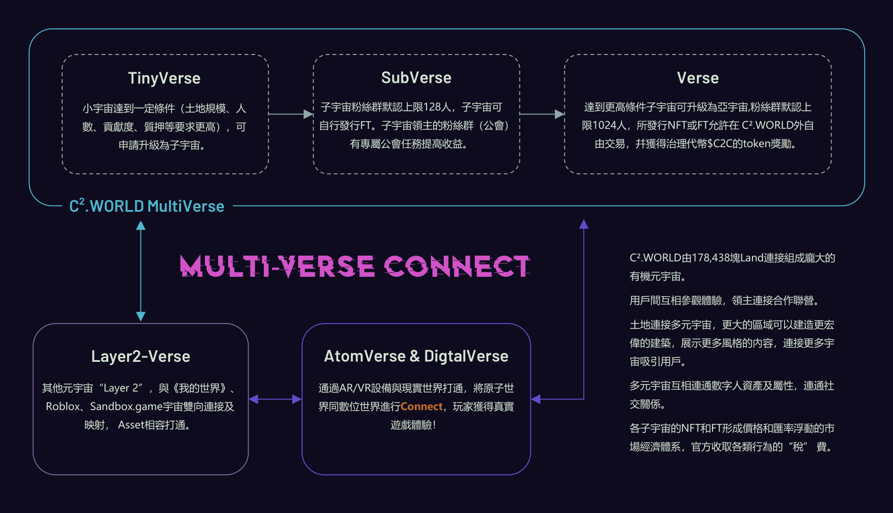

# Create

By switching the authoring mode with the C².WORLD built-in authoring tool, digital citizens can quickly customize and create their own scenes, assets and multiverses and other content based on the content motherboard, whether it is in their own land, as a land-connected universe or in the market Selling to others can generate income.

### MOD build-in

MOD build-in is an easy-to-use authoring tool, even if you are not an experienced designer, you can design, create, and share your creations in the C².WORLD metaverse. It is your tool for expressing your creativity and imagination.

The MOD build-in has a rich and in-depth master library of social elements, topics and play points, and many can be interacted online:

* Classics: Mario, Contra, Pac-Man, Bomberman, Submarine, Xiao Xiaole, etc.
* Trendy Play: Current affairs, popular anime games, MOBA, tower defense, war simulators, squid games, spoofs, etc.
* Sociability: Drifting bottle, big fight, art gallery, Ferris wheel, bar, online farm and stealing vegetables, captive friends, paid movie room, online co-construction, private couple's house, birthday party, love garden surprise experience, etc.

Just simply drag and drop game objects and plots, and choose to set logic and properties to create a game universe full of potential.

### Standalone Editor

If you have a certain programming foundation and want to design more content to showcase your creativity, then you can choose to use the Standalone Editor, where you can edit terrain, place characters, display items, organize buildings, and plan epic quests , different gameplay, different styles, all from a huge library of professional and community development resources. It can also be used to create mod templates for other users to use to create various mod-based game universes.

Immersive authoring, building content is as fun as playing a game, creating behaviors and editing properties is simple and intuitive, and many default masters are available. For more experienced creators, it provides richer interactive digital content creation functions, giving users greater freedom and power.

#### VoxelCreate

VoxelCreate is used to create voxel-based 3D models and animations, which greatly reduces the difficulty of 3D modeling. With the help of VoxelCreate, everyone can become an artist, create 3D voxel assets that can be used in C².WORLD and realize Animate.

* **Modeling**: VoxelCreate is very easy to use, you can create or import your own voxel objects, choose multiple types of brushes to draw various shapes for voxel creation, and support inserting existing patterns or other basic objects, as well as a customizable interface and smart Layout settings. Easy to create any desired model.
* **Animation**: VoxelCreate also supports animation of the created model.
* **Export**: You can use VoxelCreate to export your own compositions, not only as assets in C².WORLD, but also in other standard formats.
